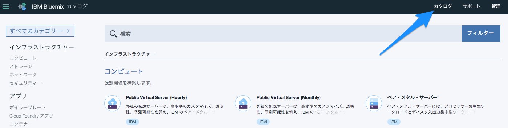
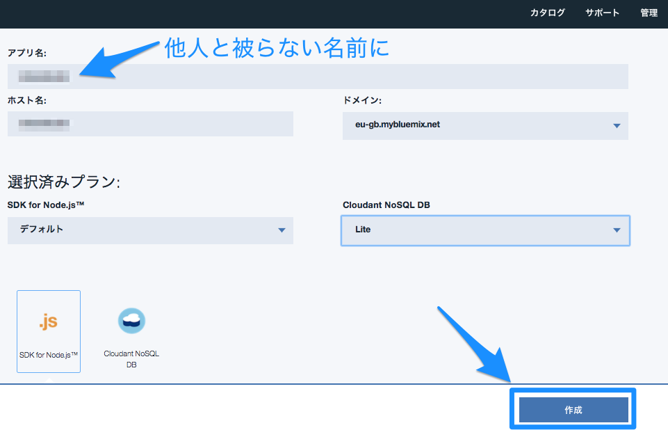
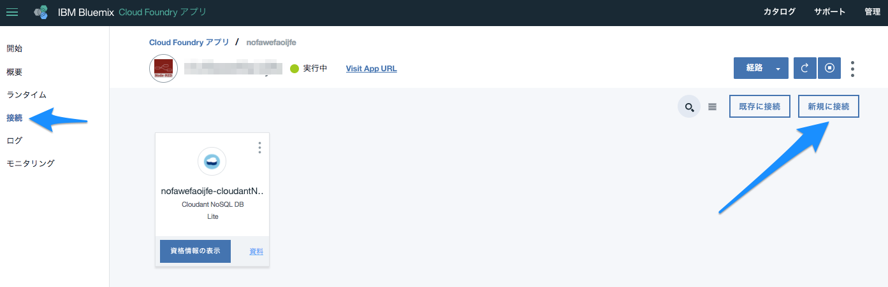

## Watsonの画像認識をBluemixのNode-REDから呼び出そう!(Visual Recognition V3)
***
### 概要

IBM Watsonのサービスの一つである画像認識APIを呼びだす簡単なサンプルです。

Node-REDを使って簡単に呼び出しているのが特徴です。   
IBM Bluemixを使えば簡単に、そして迅速にアプリケーションを作ることが可能です。  

プログラミングが初めて、あるいは始めたばかりの方にもわかりやすいように解説させていただきます。

***
ノード解説
#### Watson Visual Recognition

IBMがBluemixは様々なコグニティブAPIを提供しています。その中でもVisual Recognitionは画像解析から年齢や人物判定まで行う機能を持ったサービスです。IBM Watsonのサービスなので確認してみてください。

***
### 全体フロー概要

画像のURL（例："http://xxxxx.jpg" ）をVisual RecognitionのAPIにかけると画像解析を行い、顔認識の結果を返してくれるサンプルアプリです。


***
## 1.BluemixでNode-REDサービス、WatsonのAPIを設定する

### 1-1.Node-RED/Watson APIの準備
まず、Node-REDのサービスを立ち上げます。

カタログをクリック。


次にボイラーテンプレートからNode-RED Starterをクリックします。


画面が変わるのでアプリケーション名を他人と被らないように入れます。（英文字とハイフンはOKです）
名前を入れたらそのまま右下にある作成ボタンをクリック。


その後、みなさんのクラウド環境上にNode-REDのアプリケーションが作成されます。アプリケーション名のすぐ右側のステータスが'実行中'に変わったら、Visit App URLをクリックします。


Welcome画面が表示されたら成功です！
次に右下のNextをクリックして先に進めます。


ここでは便宜上、ユーザー認証を設定しません。（通常はお勧めしません）
Allow anyone〜　をクリックしてすぐしたのチェックボックスにチェックを入れます。
右下のNextをクリックして先に進めます。


Flow Libraryの説明画面になるので、そのまま右下のNextで先に進みます。


最後はFinishをクリックしてNode-REDアプリの完成です！


Node-REDの初期画面が出てきたら成功です。さっそくGo to your Node-RED flow editorをクリックしてみましょう。


フローエディタが出てきました！これで完成です。


***
## 2.Visual Recognition APIを追加する
さて、次にWatsonのAPIを準備するため、Bluemixのコンソール画面に戻ります。左側のメニューから接続をクリック。その後、Node-REDにバインドされているサービス一覧が表示されるので、右側にある新規に接続をクリック。


そのままWatsonのVisual Recognitionを探してクリックしてください


Visual Recognitionのサービス説明画面になるので、右下の作成ボタンをクリック。


再ステージのポップアップが表示されるので、OKをクリックして再起動させます。

Bluemixのダッシュボードの"概要"メニューをクリックすると、Visual  Recognitionが接続されていることを確認できます。


アプリケーションが再起動されたら、ダッシュボードのステータスを確認し実行中のステータスであることを確認しurlをクリックします。


これで準備が整いました。


## 3.Node-REDでプログラミング

### 3-1.HTTP Input node

Visual RecognitionはRESTのGETメソッドでアクセスして画像を解析します。  
まずは左側のパレットのInputカテゴリ内のhttpのnodeをドラッグ&ドロップし、キャンバス内に配置します。
プロパティー内のURL欄にアクセスポイントを記載します。ここでは/callwatson　とでもしておきます。


Nameの欄はノードの名前をわかりやすいようにしておくために記述しておきます。任意ですが、ここではHTTP Inputにしておきます。

### 3-2.switch node

画像のURLをチェックするノードを準備します。
左側のリソースパレットのfunctionカテゴリ内のswitchノードをフローエディタ中央のキャンバスにドラッグ&ドロップします。  
プロパティー内の左下にある+ruleをクリックして、分岐ロジックを2つ用意します。
Propertyは以下の通りにimagurl属性に含まれるペイロードのnullチェックを行います。
nullであれば、"1"にそれ以外であれば"2"に値が渡されます。


### 3-3 template node (初期画面)

画面のHTMLを表示したり、Inputとなる画像を送信するためのメニューを提供するためにHTMLを記述します。
temlpalteノードをフローエディタ中央のキャンバスにドラッグ&ドロップします。  
プロパティを以下のように記述します。


```
<h1>Welcome to a Watson Visual Recognition sample Face Detection app</h1>
<H2>Recognize anyone?</H2>
<form  action="{{req._parsedUrl.pathname}}">
    
    
    
    
        <br/>Right-click one of the above images and select Copy image location and paste the URL in the box below.<br>Do an image search for faces, try multiple faces. After you click on an image, to the right it usually says "View image" click that to get the URL.<br/>
    <br>Image URL: <input type="text" name="imageurl"/>
    <input type="submit" value="Analyze"/>
</form>
```


### 3-4.change node

入力画面から画像URLを抽出するchangeノードを定義します。左側のリソースパレットのfunctionカテゴリ内のchangeノード
をフロー・エディタ中央のキャンバスにドラッグ&ドロップします。
ここからpayload属性をimageurl属性に変換します。以下の通りにプロパティを設定します。


### 3-5.Image Analysis

画像解析のためのImage Analysisノードを定義します。左側のリソースパレットのWatsonカテゴリ内のImage Analysisノード をフロー・エディタ中央のキャンバスにドラッグ&ドロップします。
プロパティーでは顔認識を行うため、以下の通りにDetectをDetect Faceに設定します。


### 3-6. template node (結果)

WatsonのImage Analysisから返ってきた結果を表示させるためのHTMLを記載します。temlpalteノードをフローエディタ中央のキャンバスにドラッグ&ドロップします。  
プロパティを以下のように記述します。


```
<h1>Visual Recognition v3 Image Analysis</h1>
    <p>Analyzed image: {{result.images.0.resolved_url}}<br/></p>
    {{^result}}
        <P>No Face detected</P>
    {{/result}}
    <p>Images Processed: {{result.images_processed}}</p>
    <table border='1'>
        <thead><tr><th>Age Range</th><th>Confidence</th><th>Gender</th><th>Confidence</th><th>Name</th></tr></thead>
        {{#result.images.0.faces}}<tr>
            <td><b>{{age.min}} - {{age.max}}</b></td><td><i>{{age.score}}</i></td>
            <td>{{gender.gender}}</td><td>{{gender.score}}</td>
            <td>{{identity.name}} ({{identity.score}})</td>
        </tr>{{/result.images.0.faces}}
    </table>
    <form  action="{{req._parsedUrl.pathname}}">
        <br><input type="submit" value="Try again or go back to the home page"/>
    </form>
```


### 3-7.フローをつなげる

出来上がった客ノードをつなげて、右上のDepoyをクリックすれば完成です!エラーが出ていないことを確認してください。


## 4.動作確認
ブラウザのURL欄にhttp://xxxx.mybluemix.net/callwatson をインプットして呼び出してみましょう。
Image URLの入力欄にWatsonに読ませたい画像URLを入れてみてください。

顔の認識や人物名が出てきます！さすがWatson！

