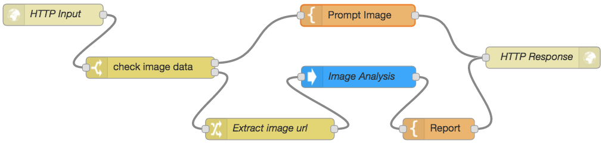

## Alchemy APIををBluemixのNode-REDから呼び出そう!
***
### 概要

IBM Watsonのサービスの一つであるAlchemy APIを呼びだす簡単なサンプルです。

Node-REDを使って簡単に呼び出しているのが特徴です。   
IBM Bluemixを使えば簡単に、そして迅速にアプリケーションを作ることが可能です。  

プログラミングが初めて、あるいは始めたばかりの方にもわかりやすいように解説させていただきます。

***
ノード解説
#### Alchemy Image Analysis node

IBMがBluemixは様々なコグニティブAPIを提供しています。その中でもAlchemyの画像認識サービスであるImage Analysisは画像解析から年齢や人物判定まで行う機能を持ったサービスです。IBM Watsonのカテゴリに入っているので確認してみてください。

***
### 全体フロー概要

画像のURL（例："http://xxxxx.jpg" ）をImage AnalysisのAPIにかけると画像解析を行い、顔認識の結果を返してくれるサンプルアプリです。




***
## 1.BluemixでNode-REDサービス、WatsonのAPIを設定する

### 1-1.Node-REDの準備


### 1-2.Watson APIの準備
***


## 2.Node-REDでプログラミング

### 2-1.HTTP Input node

AlchemyAPIはRESTのGETメソッドでアクセスして画像を解析します。  
まずは左側のパレットのInputカテゴリ内のhttpのnodeをドラッグ&ドロップし、キャンバス内に配置します。
プロパティー内のURL欄にアクセスポイントを記載します。ここでは/callwatson　とでもしておきます。

Nameの欄はノードの名前をわかりやすいようにしておくために記述しておきます。任意ですが、ここではHTTP Inputにしておきます。

### 2-2.switch node

画像のURLをチェックするノードを準備します。
左側のリソースパレットのfunctionカテゴリ内のswitchノードをフローエディタ中央のキャンバスにドラッグ&ドロップします。  
プロパティー内の左下にある+ruleをクリックして、分岐ロジックを2つ用意します。
Propertyは以下の通りにimagurl属性に含まれるペイロードのnullチェックを行います。
nullであれば、"1"にそれ以外であれば"2"に値が渡されます。


### 2-3 template node

画面のHTMLを表示したり、Inputとなる画像を送信するためのメニューを提供するためにHTMLを記述します。
temlpalteノードをフローエディタ中央のキャンバスにドラッグ&ドロップします。  

```
<h1>Welcome to the Alchemy Vision Face Detection Demo on Node-RED</h1>
<H2>Select an image</H2>
<form  action="{{req._parsedUrl.pathname}}">
    
    
    
        <br/>Copy above image location URL or enter any image URL:<br/>
    Image URL: <input type="text" name="imageurl"/>
    <input type="submit" value="Analyze"/>
</form>
```


### 2-4.change node

入力画面から画像URLを抽出するchangeノードを定義します。左側のリソースパレットのfunctionカテゴリ内のchangeノード
をフロー・エディタ中央のキャンバスにドラッグ&ドロップします。
ここからpayload属性をimageurl属性に変換します。以下の通りにプロパティを設定します。
